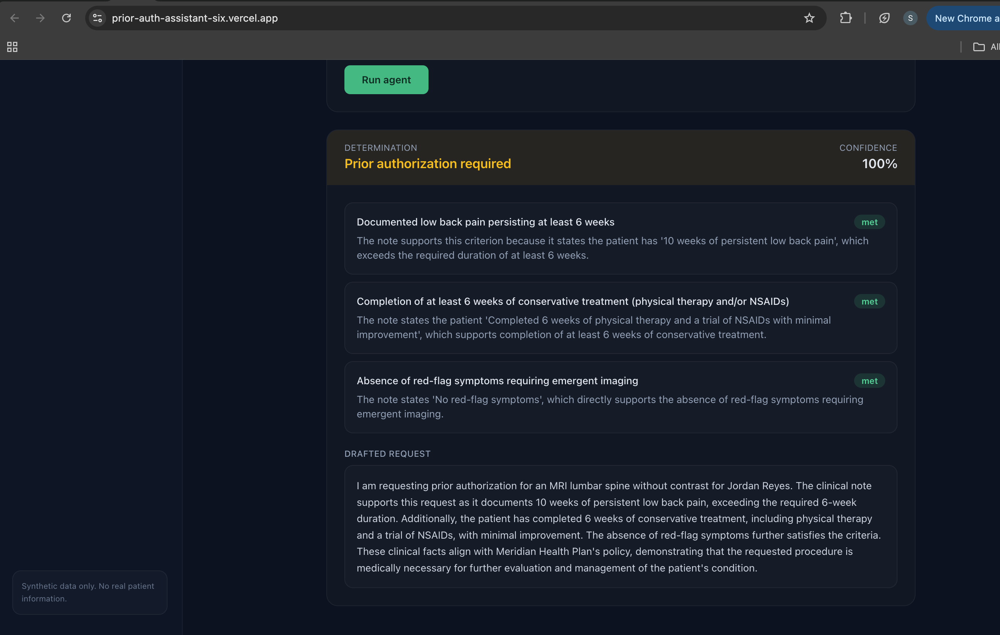
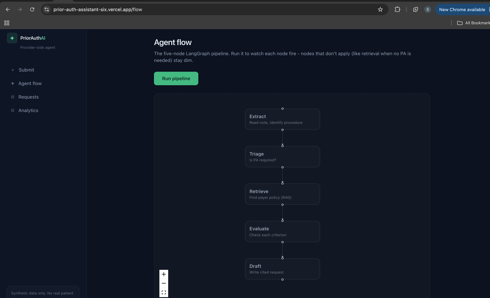
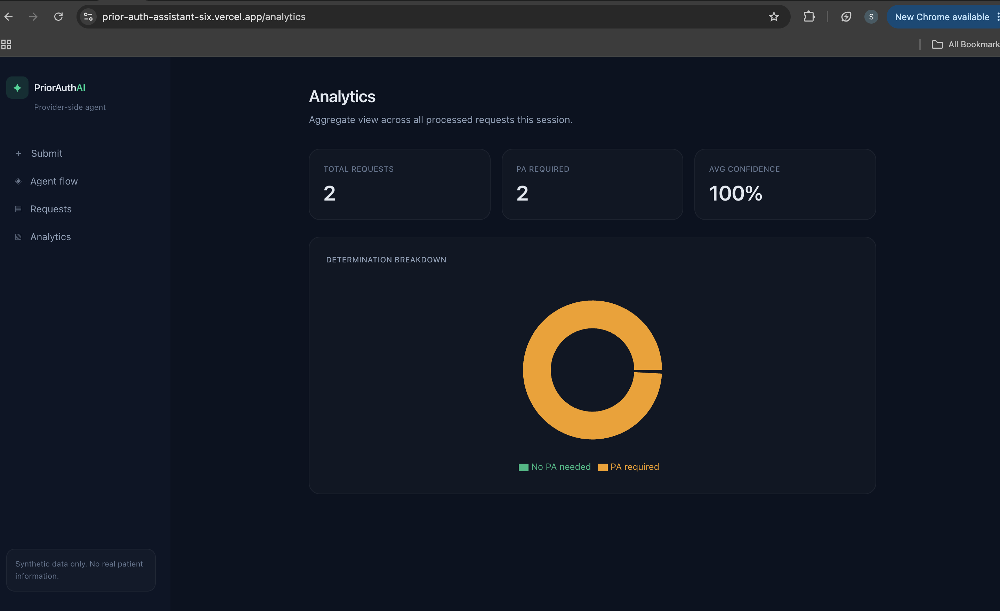

# ⚕️ Prior Authorization Assistant

> An AI agent that helps provider offices get insurance approval *before* treatment. A staffer submits a clinical note; a LangGraph agent reads it, determines whether prior authorization is required, retrieves the relevant payer policy, checks the patient against its criteria, and drafts a justified authorization request with citations and a confidence score.


**Live app:** https://prior-auth-assistant-six.vercel.app
**Live API:** https://prior-auth-assistant.onrender.com/api/health

> ⏳ The API runs on a free tier that sleeps when idle — the first request may take 30–50 seconds to wake it.

---

## What It Does

Prior authorization is one of the most-hated parts of US healthcare: provider offices spend hours per physician each week manually justifying procedures to insurers before care can happen. This tool automates that first draft.

A staffer pastes a clinical note and the requested procedure. The agent then:

1. **Extracts** the requested procedure from the note
2. **Triages** whether prior authorization is even required — if not, it short-circuits
3. **Retrieves** the governing payer policy
4. **Evaluates** the patient against each policy criterion using an LLM, marking each met / unmet / uncertain with a grounded justification
5. **Drafts** a complete, cited authorization request and scores its confidence

This is the provider-side mirror of a [claims adjudication platform](https://github.com/Sakshi3027/claims-adjudication-platform): one gets approval *before* treatment, the other decides payment *after* it — together covering both ends of the healthcare authorization lifecycle.

---

## Screenshots

**Adjudication result — determination, per-criterion reasoning, and drafted request**


**Agent flow — the five-node LangGraph pipeline, visualized**


**Analytics — determination breakdown across processed requests**


---

## The Agent

Built as five discrete LangGraph nodes, kept separate so the pipeline is inspectable and extensible:
extract → triage → (branch)
if PA required: retrieve → evaluate → draft → END
if not required: END

The conditional branch after triage is a real short-circuit: procedures that don't need prior authorization skip retrieval, evaluation, and drafting entirely.

---

## Tech Stack

- **LangGraph + FastAPI** — agent orchestration and REST API
- **Groq (Llama 3.3 70B)** — the reasoning behind criterion evaluation and drafting
- **Postgres + pgvector (Supabase)** — request persistence and policy embeddings in one database
- **FHIR-modeled data** — patients, conditions, and service requests follow the FHIR resource shape the CMS prior authorization rule is built around
- **Next.js + Tailwind** — three-view dashboard (Submit, Agent Flow, Analytics)
- **Recharts + React Flow** — analytics charts and the agent-pipeline visualization
- **Docker → Render**, **Vercel**, **Supabase** — deployment

---

## Architecture
```
Clinical note (Next.js UI)
↓
FastAPI → LangGraph agent (Groq)
↓
Postgres / pgvector (Supabase)
├─ requests (persisted decisions + full agent trace)
└─ policies (payer criteria + embeddings)
```

The policy-retrieval layer is deliberately isolated from the agent, so real payer-policy ingestion can later replace the synthetic policies without touching agent logic.

---

## Data & Safety

All clinical notes and payer policies are **synthetic** — no real patient information. Patient data is modeled as FHIR resources for domain authenticity.

---

## Running Locally

```bash
# Backend
cd backend
python3 -m venv venv && source venv/bin/activate
pip install -r requirements.txt
# set GROQ_API_KEY and DATABASE_URL in backend/.env
python -m db.init_db          # enable pgvector, create tables, seed policies
uvicorn api.main:app --reload --port 8000

# Frontend (separate terminal)
cd frontend
npm install
npm run dev                    # http://localhost:3000
```

---

## Advanced Capabilities

Beyond the core adjudication flow, the platform includes five production-minded extensions, each built on the same isolated agent and policy layers:

- **Appeals agent** — when a request has unmet or uncertain criteria (a likely denial), a second agent drafts an appeal letter that argues for reconsideration, honestly acknowledging the gaps while leaning on the supporting evidence that does exist.
- **Human-in-the-loop override** — a reviewer can override any determination (approve what the agent flagged, or deny what it approved) with a reason, persisted and surfaced as an audit badge. Mirrors the auditor override on the companion claims platform.
- **Batch mode** — processes a whole queue of pending requests in one run, useful for overnight processing of a day's submissions, feeding richer analytics.
- **FHIR PAS API layer** — exposes each decision as a FHIR **Prior Authorization Support** `Claim` + `ClaimResponse` bundle, the format the CMS interoperability rule mandates for prior authorization over FHIR. `GET /api/fhir/claim/{id}`.
- **Payer-policy PDF ingestion** — a pipeline that takes a real payer-policy PDF, extracts and structures it with an LLM, embeds it, and loads it into the policies table. Because the policy layer is isolated from the agent, an ingested policy is immediately adjudicable with zero code changes.

---

## Designed This Way on Purpose

Three early decisions made those extensions additive rather than rewrites:

- **Five discrete agent nodes** — so an appeals path or a new step slots in without disturbing the pipeline.
- **An isolated policy-retrieval layer** — so real ingested policies flow into the same table the agent already reads from.
- **FHIR-modeled data from day one** — so the CMS-compliant PAS layer was a mapping, not a migration.

---

Built by [Sakshi Chavan](https://github.com/Sakshi3027)
AI Engineer | LangGraph • RAG • Databricks | MS Data Science | https://www.linkedin.com/in/sakshi-v-chavan | https://medium.com/@SakshiChavan